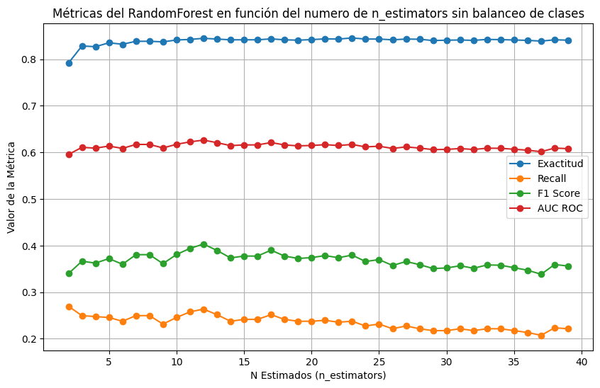
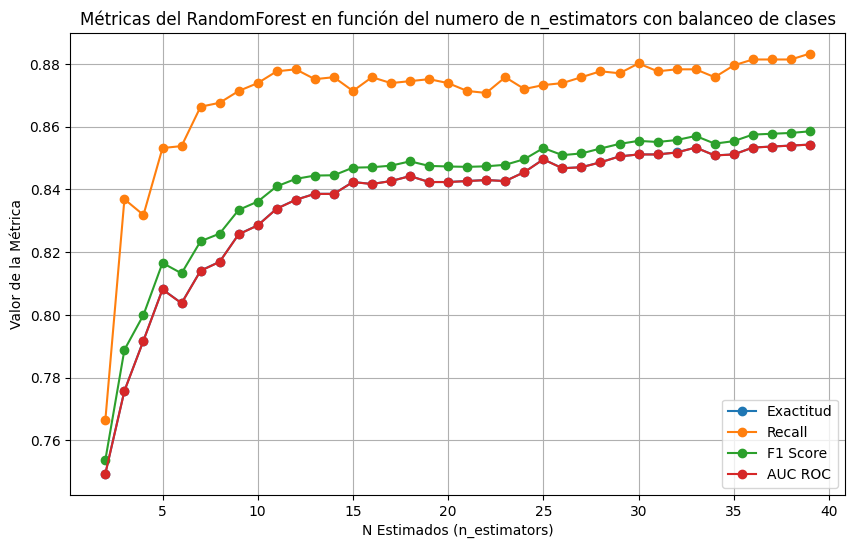
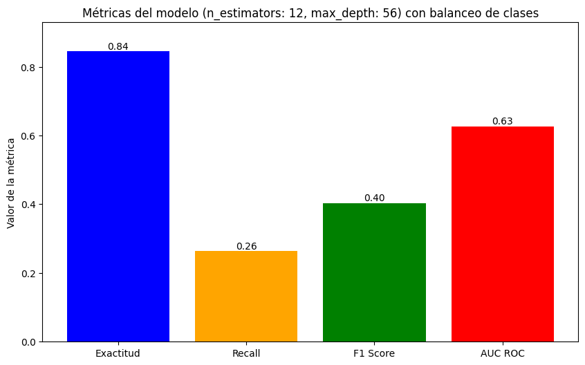
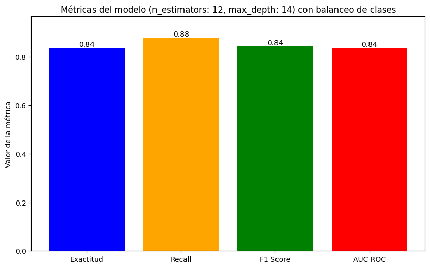
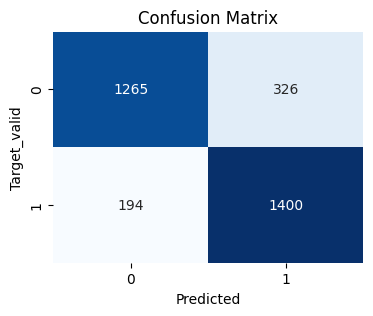

# Proyecto: Modelo Predictivo para Detectar Clientes en Riesgo de Deserción en Beta Bank

## Descripción del Proyecto
El objetivo de este proyecto es desarrollar un modelo predictivo que permita identificar clientes con alto riesgo de cancelar sus cuentas en **Beta Bank**. Retener clientes existentes es más rentable que adquirir nuevos, por lo que este modelo ayudará al banco a priorizar estrategias de retención.

Se utilizaron datos históricos sobre el comportamiento de los clientes, incluyendo características como saldo, edad, género, país, actividad, número de productos y estado de cancelación de la cuenta. El modelo debe alcanzar un puntaje F1 mínimo de **0.59**.

---
Se optimizaron los hiperparámetros de cada modelo mediante validación cruzada y se ajustaron las técnicas para manejar el desequilibrio de clases, como el **sobremuestreo** y el **submuestreo**.
Se resalta la comparacion de trabajar con balanceo de clases vs trabajar sin balanceo de clases y se comparan resultados para ver las consecuencias de ambos.

### Optimización del Modelo Seleccionado
El modelo final seleccionado fue el **Bosque Aleatorio** debido a su rendimiento superior:
Sin Balanceo de clases usamos:
- **n_estimators**: 12 
- **max_depth**: 56
  

  
Con Balanceo de clases usamos
- **n_estimators**: 12 
- **max_depth**: 14
  

---

## Resultados del Modelo - Metricas del Modelo sin Balanceo de clases

## Resultados del Modelo - Metricas del Modelo con Balanceo de clases

### Matriz de Confusión
La matriz de confusión reveló:
- Alta proporción de verdaderos positivos y negativos.
- Baja cantidad de falsos positivos y falsos negativos, confirmando un rendimiento robusto.
  

---

## Hallazgos y Conclusión
1. **Consistencia del modelo**:
   - La validación cruzada demostró que el modelo generaliza bien en diferentes subconjuntos de datos.

2. **Impacto práctico**:
   - El modelo predictivo es una herramienta valiosa para priorizar clientes en riesgo y diseñar estrategias de retención.

3. **Recomendaciones**:
   - Implementar este modelo en el flujo operativo del banco para mejorar la experiencia del cliente y reducir la tasa de deserción.

Este modelo posiciona a Beta Bank para tomar decisiones informadas y fortalecer la lealtad de sus clientes.

## Hallazgos

1. **Configuración de Parámetros**:

- n_estimators: Se fijó en 12, ya que a partir de ese valor las métricas se estabilizan y se evita incrementar el costo computacional de manera innecesaria.
- max_depth: Se estableció en 14, puesto que valores mayores no aportan mejoras significativas en los resultados, lo que permite optimizar el rendimiento sin sobrecargar el cómputo.

2. **Rendimiento del Modelo con los Parámetros Configurados:**

- Las métricas indican que el modelo tiene un desempeño adecuado, destacándose especialmente el F1_score y el recall.
- La matriz de confusión revela una alta cantidad de verdaderos positivos y verdaderos negativos, mientras que los falsos positivos y falsos negativos son mínimos.
- Exactitud (Accuracy): El modelo identifica correctamente el 84% de los casos positivos, lo cual es un indicador sólido.
- Recall (Sensibilidad): Con un 88% de verdaderos positivos correctamente identificados, el modelo demuestra una alta capacidad para detectar la clase positiva.
- F1_score: Con un valor del 84%, se confirma la robustez del modelo al equilibrar precisión y recall.
- AUC ROC: Un 84% en esta métrica indica que el modelo tiene un rendimiento significativamente superior al de un clasificador aleatorio.
- La validación cruzada refuerza la consistencia del modelo, mostrando una exactitud del 80% y una desviación estándar de 0.0076, lo que sugiere estabilidad en diferentes particiones de los datos.

## Conclusión:

Los resultados demuestran que trabajar con clases balanceadas ofrece mejoras sustanciales en la exactitud y sensibilidad del modelo en comparación con el manejo de clases desbalanceadas.
Se recomienda implementar técnicas de balanceo de clases para asegurar una mayor generalización, robustez y consistencia en el rendimiento del modelo.
